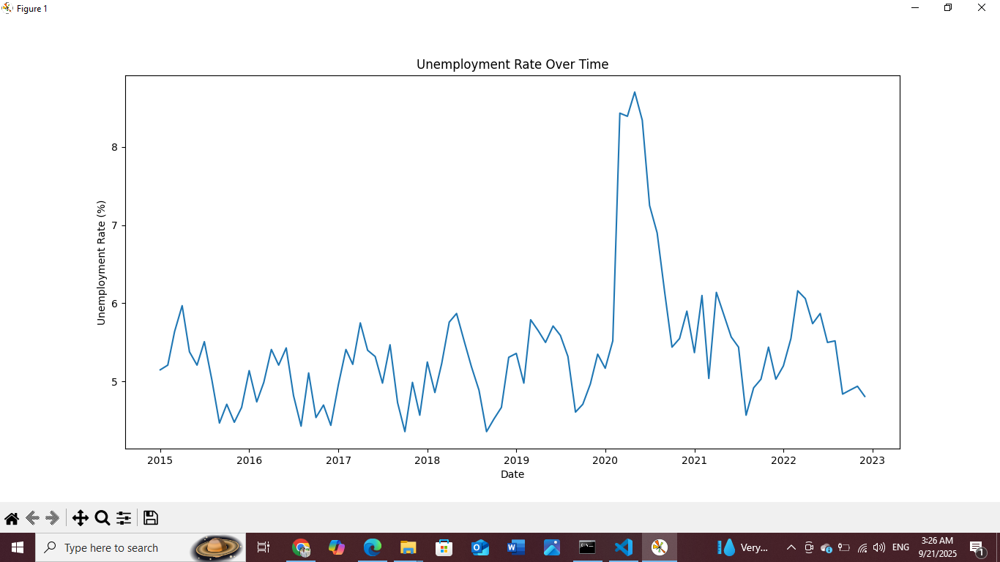
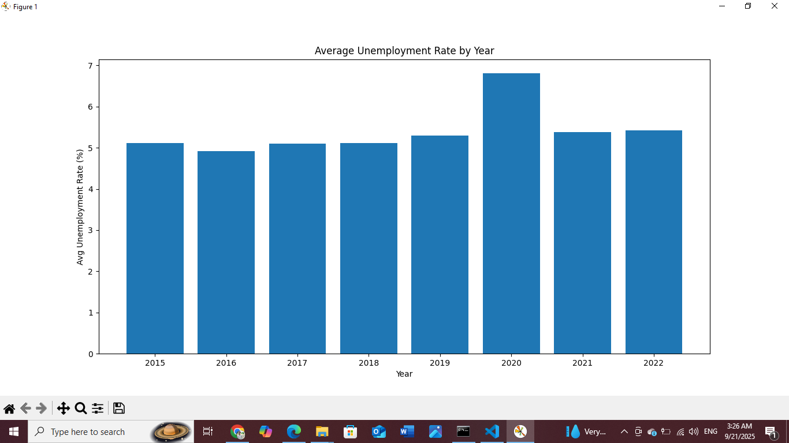
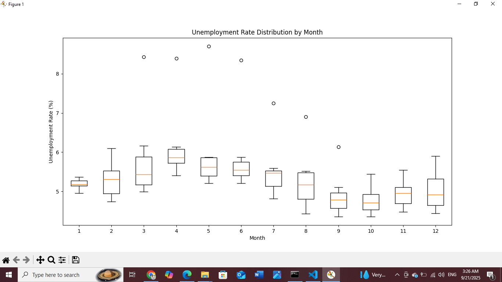

# 📊 Unemployment Analysis | Python Data Analysis Project  

A beginner-friendly **Python project** to analyze and visualize unemployment data.  
This project focuses on data cleaning, exploration, and visualization while investigating the **impact of Covid-19 on unemployment trends**.    
 
---
  
## 📋 Table of Contents  
- 📚 Project Overview  
- 🚀 Features  
- 🧠 Concepts Covered  
- ⚙️ Installation  
- 🎮 How to Use  
- 📸 Screenshots  
- 🚧 Future Enhancements  
- ✨ Author  
- 📄 License  

---

## 📚 Project Overview  

This project uses **real-world unemployment data** to:  
- Explore unemployment rate trends over time  
- Highlight the **economic effects of Covid-19**  
- Identify **seasonal patterns** in unemployment  
- Provide insights that could inform **economic and social policies**  

The project demonstrates the use of **Python for Data Analysis** with libraries like Pandas and Matplotlib.  

---

## 🚀 Features  

- Load unemployment data from **CSV**  
- Clean and preprocess data  
- Visualize **unemployment rate trends** over time  
- Compare **yearly averages** (2015–2020)  
- Analyze **Covid-19 impact** (2019 vs 2020)  
- Show **monthly seasonal patterns** with boxplots  
- Save cleaned dataset for future use  

---

## 🧠 Concepts Covered  

- Data Cleaning (handling nulls, formatting dates)  
- Exploratory Data Analysis (EDA)  
- Data Visualization (line plots, bar charts, boxplots)  
- Working with **time-series data**  
- Grouping and aggregating datasets  
- File handling with Pandas (`.csv`)  

---

## 📸 Screenshots  

### ▶ Graph 
  

### ▶ Unemployment Rate by Year
  

### ▶ Unemployment Rate by Month
  

---
## 🎮 How to Use

When you run the script, it will:

- Show the first few rows of the dataset
- Display data info & summary
- Generate visualizations:
  - 📈 Line chart → Unemployment over time
  - 📊 Bar chart → Average unemployment by year
  - 📦 Boxplot → Monthly trends
- Print comparison of 2019 vs 2020 unemployment rates
- Save the cleaned dataset as `cleaned_unemployment.csv`
  
---

## 🚧 Future Enhancements

- Add **Seaborn** for advanced visualization
- Build an **interactive dashboard** using Plotly/Dash
- Train a **forecasting model** for unemployment predictions
- Automate **report generation** (PDF/Excel export)
- Compare unemployment with **GDP growth** and **inflation rates**

---

## ✨ Author

Developed by ❤️ **M. Talal Liaquat** ❤️  

- LinkedIn: [Talal Liaquat](https://www.linkedin.com/in/talal-liaquat/)  

---

## 📄 License

 This project is licensed under the **MIT License**.

